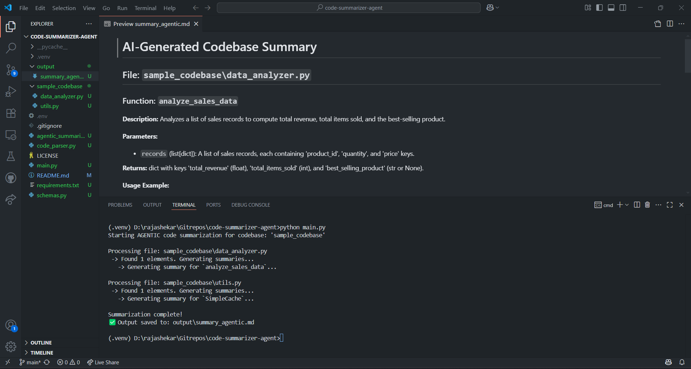

# AI Agentic Code Summarizer

This project is a helper bot, an "AI Agent," that tackles to make you understand a complex codebase to your easily readable **Markdown Format**.

It automatically reads a Python codebase, understands what each function and class does, and writes clear, consistent documentation for it.

## Demo

Click on it to view demo

[](https://www.youtube.com/watch?v=2R4y794bXss)

## How Does It Work?
The process is pretty neat and happens in three main steps:

1. Code Parsing : uses **Python's built-in ast (Abstract Syntax Tree) library**. This lets it understand the code's actual structure, accurately finding every function and class without mistakes.

2. The Agentic Brain (**LangChain + LLM API/Local Models**): This agent's job is to take a piece of code and ask a powerful Large Language Model to analyze it. Crucially, we tell the AI to return its findings in a **strict JSON format**, not just plain text. This ensures we always get the data we need.

3. Pretty Markdown Generation: Once the agent gets the structured data back from the AI, it neatly formats it into a beautiful and easy-to-read Markdown file, complete with descriptions, parameters, usage examples, and more.

    ```bash
    code_summarizer-agent/
    |
    ├── sample_codebase/        # Contains sample files
    │   └── utils.py            # Put any project directory here or files
    |   └── data_analyzer.py
    |
    ├── output/                 # Contains tested output
    │   └── summary_agentic.md  # Summarized Code in Markdown
    |
    ├──.env                     # Store your API Keys here
    ├── schemas.py              # Defines our output data structure
    ├── code_parser.py          # AST Parser
    ├── agentic_summarizer.py   # Integrates LangChain and your LLM
    ├── main.py                 # Entry point to your app
    └── requirements.txt        # Has all the requirements needed/Add new accodingly
    ```

## Getting Started

### Prerequisites
* Python 3.8 or higher
* Git
* An LLM API Key:
  * Groq: https://console.groq.com/keys
  * OpenAI: https://platform.openai.com/api-keys

> I've verified on Windows

1. Clone the Repository
    ```bash
    git clone https://github.com/rajashekarkasturi/code-summarizer-agent.git
    cd code-summarizer-agent/
    ```

2. Set Up a Virtual Environment (Recommended!)

    ```bash
    # On macOS/Linux
    python3 -m venv venv
    source venv/bin/activate

    # On Windows
    python -m venv venv
    .\venv\Scripts\activate
    ```
3. Install all the necessary libraries from the requirements.txt file.

    ```bash
    pip install -r requirements.txt
    ```

4. Set Your API Key
The agent needs an API key to talk, You can get a free one from the [Groq](https://groq.com/) or from any Compatible API service check here <https://python.langchain.com/docs/integrations/chat/>.

    Once you have your key, set it as an environment variable, or put them into `.env` file

    ```bash
    # On macOS/Linux
    export GOOGLE_API_KEY="YOUR_API_KEY_HERE"
    export GROQ_API_KEY=""
    export OPENAI_API_KEY=""

    # On Windows (in Command Prompt)
    set GOOGLE_API_KEY="YOUR_API_KEY_HERE"
    set GROQ_API_KEY="YOUR_API_KEY_HERE"
    ```

5. Run the Agent!
    ```bash
    python main.py
    ```

6. Check the Output,
A new documented file will be in the `output/` directory, named `summary_agentic.md`.

## Verified Models
1. [moonshotai/kimi-k2-instruct](https://huggingface.co/moonshotai/Kimi-K2-Instruct)
2. gemini-2.5-flash

## 💡 Future Ideas & Extensions

This is just the beginning! Here are a few ways we could make this agent even more powerful:

1. Integrate Local LLMs(Code specialized) - served using ollama/vLLM/Langchain Integration.

2. Multi-Language Support: Train the agent to understand and document other languages like JavaScript, Java, or C++.

3. Interactive Web App: Build a simple web interface using Streamlit or Flask where you can paste code and get instant documentation.

4. CI/CD Integration: Set up a GitHub Action that automatically runs the agent on every git push, ensuring the documentation is never out of date.

## Key Learnings

Building this project was a fantastic learning experience. Here are my biggest takeaways:

1. ast is King: Using Abstract Syntax Trees is far more robust and reliable for code analysis than regular expressions.

2. Structured Output is a Game-Changer: Simply prompting an LLM for text can be flaky. Using LangChain with Pydantic schemas to force structured JSON output makes the system predictable and reliable.

3. Prompt Engineering Matters: The quality of the output is directly related to the quality of the instructions (the prompt). Being clear and specific is key.


Thanks for checking this out!

## 🙏 Acknowledgements
The LLM providers - [Groq](https://groq.com/), for their powerful models.